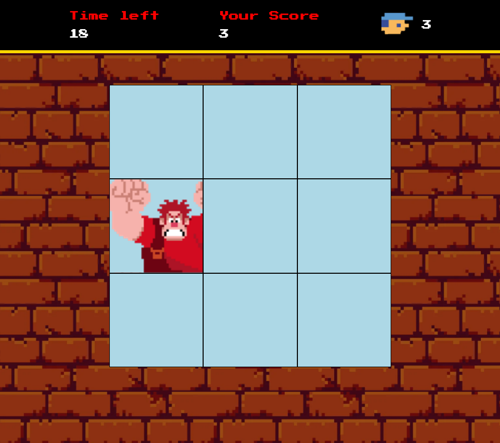

<h1 align="center">🏆 Desafio de projeto - Detona Ralph</h1>

  
Bem-vindo ao **Game Detona Ralph**! Neste repositório, você encontrará um jogo divertido baseado no famoso filme "Detona Ralph". Este projeto não apenas oferece entretenimento, mas também demonstra várias técnicas avançadas de desenvolvimento de jogos em JavaScript.

<h2>Conheça o projeto clicando na imagem abaixo:</h2>

### Tecnologias Utilizadas

- HTML5 e CSS3 para a estrutura e aparência do jogo.
- JavaScript para a lógica de programação e interatividade.
- Sprites e imagens customizadas para criar a estética única do universo de Detona Ralph.

### Funcionalidades Incríveis

- **Sistema de Pontuação**: Acompanhe sua pontuação à medida que progride no jogo e desafie seus amigos a superá-la, clique no quadrado que o Ralph se encontre

### Como Jogar

1. Clone este repositório para sua máquina local.
2. Abra o arquivo `index.html` em seu navegador web.
3. Marque pontos clicando em cima das caixas que aparecem o personagem.

### Contribuição

1. Adicionei a funcionalidade de diminuir vidas quando o tempo zera
2. Adicionei o botão de continuar o jogo

### Créditos

Este jogo foi desenvolvido como parte de um projeto educacional da Digital Innovation One.

---

Divirta-se jogando o **JSGame Detona Ralph** enquanto explora as técnicas modernas de desenvolvimento de jogos em JavaScript. Lembre-se de conferir o repositório original [aqui](https://github.com/digitalinnovationone/jsgame-detona-ralph) e deixar uma ⭐️ se você gostou do projeto!